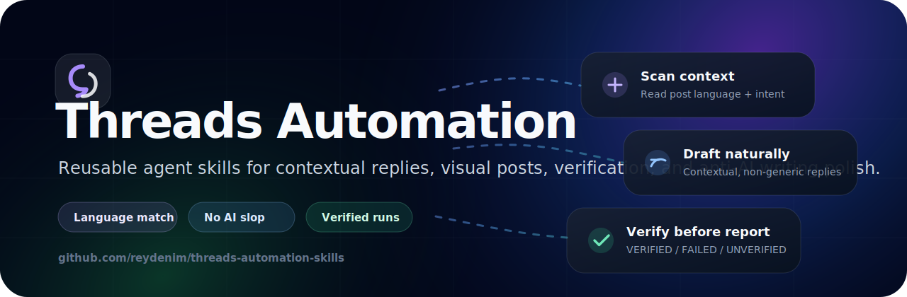

# Threads Automation Skills



Reusable agent skills for Threads automation: contextual engagement, reply-back, visual post publishing, verification, and anti-AI writing polish.

## Language / Bahasa

- [English](#english)
- [Bahasa Indonesia](#bahasa-indonesia)

---

## English

### Skills included

- `threads-engagement` — Threads workflow for posting, liking, replying, reply-back, duplicate checks, language matching, and verification.
- `avoid-ai-writing` — writing polish skill to reduce generic/AI-ish captions and replies. Based on Conor Bronsdon's MIT-licensed `avoid-ai-writing` skill.

### Install

```bash
npx skills add reydenim/threads-automation-skills --all
```

Or install manually by copying the skill folders into your agent skills directory.

### What it helps agents do

- Restore/check Threads login session from local cookies.
- Create Threads posts with image + caption.
- Reply contextually to activity/notifications.
- Match the target post language.
- Avoid generic AI-sounding replies.
- Check duplicates before replying.
- Verify posted replies via the profile Replies tab.
- Produce clean reports with `VERIFIED`, `FAILED`, or `UNVERIFIED` status.

### Optional: Account persona layer

This skill now includes a persona/vibe/lore layer so the account can feel like a real internet character instead of a generic reply bot. Customize it inside `threads-engagement/SKILL.md`.

Suggested fields to edit:

- Core persona — who the account is.
- Vibe keywords — casual, curious, witty, calm, builder-minded, etc.
- Lore anchors — recurring themes and backstory.
- Voice rules — language, emoji, humor, reply length, boundaries.
- Content archetypes — repeatable post categories.

Example direction:

```text
@YOUR_USERNAME is a casual internet-native creator/builder exploring AI tools, creator workflows, airdrops, and digital systems.
The account sounds curious, playful, self-aware, and practical — like an internet friend with taste, not a corporate brand.
```

### Required setup

1. Replace `@YOUR_USERNAME` in your prompts/cronjobs with your Threads username.
2. Export your own Threads cookies/session using Cookie-Editor or a similar extension.
3. Save your cookies locally, for example:

```text
~/.hermes/browser-sessions/threads.json
```

Do **not** commit or share your cookie/session file.

### Quickstart: from install to running automation

Follow this flow after installing the skills.

1. **Install the skills**

```bash
npx skills add reydenim/threads-automation-skills --all
```

2. **Log in to Threads in your browser**

Open Threads, log in normally, and make sure your profile loads.

3. **Export your Threads cookies/session**

Use Cookie-Editor or a similar browser extension. Export cookies for `threads.com` / `www.threads.com` as JSON.

4. **Save the session file locally**

Create the browser session directory and save the exported JSON here:

```bash
mkdir -p ~/.hermes/browser-sessions
# Save/export your cookies as:
# ~/.hermes/browser-sessions/threads.json
```

5. **Create a cronjob / scheduled automation**

In your agent scheduler, create a recurring job using the `threads-engagement` and `avoid-ai-writing` skills. Example prompt:

```text
Every 45 minutes, perform balanced Threads engagement for @YOUR_USERNAME using the saved browser session at ~/.hermes/browser-sessions/threads.json.

Rules:
- Verify login first.
- Scan candidate posts or activity notifications.
- Like up to 5 posts per run.
- Reply at most once per run.
- Match target post language.
- Apply avoid-ai-writing pass before posting.
- Duplicate-check before replying.
- Verify replies via https://www.threads.com/@YOUR_USERNAME/replies before reporting success.
- Report VERIFIED / FAILED / UNVERIFIED honestly.
```

6. **Run one manual test first**

Before leaving it on schedule, run the job once manually. Confirm that it can:

- open Threads,
- detect the logged-in session,
- skip unclear posts,
- draft contextual replies,
- avoid duplicates,
- verify the result before reporting success.

7. **Keep verification strict**

Do not treat a reply/post as successful unless the agent verifies it on the profile or replies tab. If verification fails, the report should say `FAILED` or `UNVERIFIED`, not `VERIFIED`.

### Troubleshooting

- **Threads asks you to log in again** — your session expired. Export fresh cookies and replace `~/.hermes/browser-sessions/threads.json`.
- **Agent posts generic replies** — make sure `avoid-ai-writing` is loaded and the prompt requires contextual replies.
- **Duplicate replies happen** — add a stricter duplicate check before posting and verify the `/replies` tab.
- **No posts are replied to** — this can be correct if the context/language is unclear. The agent should skip low-confidence targets.
- **Image upload fails** — do not post text-only unless your workflow explicitly allows it.

### Example cron prompt

```text
Every 45 minutes, perform balanced Threads engagement for @YOUR_USERNAME using the saved browser session at ~/.hermes/browser-sessions/threads.json.

- Verify login first.
- Scan candidate posts or activity notifications.
- Like up to 5 posts per run.
- Reply at most once per run.
- Match target post language.
- Apply avoid-ai-writing pass before posting.
- Duplicate-check before replying.
- Verify replies via https://www.threads.com/@YOUR_USERNAME/replies before reporting success.
- Report VERIFIED / FAILED / UNVERIFIED honestly.
```

### Security notes

Never share or commit:

- `threads.json` cookies/session files
- `sessionid` cookies
- passwords
- API keys
- private account credentials

This repository contains only reusable skill instructions and docs.

---

## Bahasa Indonesia

Skill pack reusable untuk automation Threads dengan agent AI: engagement kontekstual, reply-back, posting visual, verifikasi hasil, dan polish tulisan agar tidak terasa generik/AI banget.

### Skill yang disertakan

- `threads-engagement` — workflow Threads untuk posting, like, reply, reply-back, cek duplikat, penyesuaian bahasa, dan verifikasi.
- `avoid-ai-writing` — skill polish tulisan untuk mengurangi caption/reply yang terlalu generik atau terasa seperti AI. Berdasarkan skill `avoid-ai-writing` MIT-licensed dari Conor Bronsdon.

### Cara install

```bash
npx skills add reydenim/threads-automation-skills --all
```

Atau install manual dengan copy folder skill ke direktori skills agent kamu.

### Bisa bantu agent untuk

- Restore/cek session login Threads dari cookie lokal.
- Membuat post Threads dengan gambar + caption.
- Membalas activity/notification secara kontekstual.
- Menyesuaikan bahasa reply dengan bahasa post target.
- Menghindari reply generic yang terasa seperti AI.
- Cek duplikat sebelum reply.
- Verifikasi reply lewat tab Replies di profile.
- Membuat report rapi dengan status `VERIFIED`, `FAILED`, atau `UNVERIFIED`.

### Opsional: account persona layer

Skill ini sekarang punya layer persona/vibe/lore supaya akun terasa seperti karakter internet yang punya kepribadian sendiri, bukan bot reply generic. Kamu bisa custom di `threads-engagement/SKILL.md`.

Bagian yang bisa diedit:

- Core persona — akun ini siapa.
- Vibe keywords — casual, curious, witty, calm, builder-minded, dll.
- Lore anchors — tema berulang dan cerita kecil akun.
- Voice rules — bahasa, emoji, humor, panjang reply, batasan.
- Content archetypes — kategori post yang bisa diulang.

Contoh arah:

```text
@YOUR_USERNAME adalah creator/builder internet-native yang casual, eksplor AI tools, creator workflow, airdrop, dan digital systems.
Akun terasa curious, playful, self-aware, dan praktis — kayak internet friend yang punya taste, bukan brand corporate.
```

### Setup yang dibutuhkan

1. Ganti `@YOUR_USERNAME` di prompt/cronjob dengan username Threads kamu.
2. Export cookie/session Threads milikmu sendiri memakai Cookie-Editor atau extension sejenis.
3. Simpan cookie secara lokal, contoh:

```text
~/.hermes/browser-sessions/threads.json
```

Jangan pernah commit atau membagikan file cookie/session kamu.

### Quickstart: dari install sampai automation jalan

Ikuti alur ini setelah install skill.

1. **Install skill**

```bash
npx skills add reydenim/threads-automation-skills --all
```

2. **Login Threads di browser**

Buka Threads, login seperti biasa, lalu pastikan profile kamu bisa dibuka.

3. **Export cookie/session Threads**

Pakai Cookie-Editor atau extension sejenis. Export cookie untuk `threads.com` / `www.threads.com` dalam format JSON.

4. **Simpan session file secara lokal**

Buat folder browser session, lalu simpan hasil export JSON ke path ini:

```bash
mkdir -p ~/.hermes/browser-sessions
# Simpan/export cookie kamu sebagai:
# ~/.hermes/browser-sessions/threads.json
```

5. **Buat cronjob / automation terjadwal**

Di scheduler agent kamu, buat job berulang dengan skill `threads-engagement` dan `avoid-ai-writing`. Contoh prompt:

```text
Setiap 45 menit, jalankan balanced Threads engagement untuk @YOUR_USERNAME memakai browser session yang tersimpan di ~/.hermes/browser-sessions/threads.json.

Rules:
- Verifikasi login dulu.
- Scan candidate posts atau activity notifications.
- Like maksimal 5 post per run.
- Reply maksimal 1 kali per run.
- Sesuaikan bahasa reply dengan bahasa post target.
- Jalankan avoid-ai-writing pass sebelum posting.
- Cek duplikat sebelum reply.
- Verifikasi reply lewat https://www.threads.com/@YOUR_USERNAME/replies sebelum melaporkan sukses.
- Laporkan status VERIFIED / FAILED / UNVERIFIED secara jujur.
```

6. **Jalankan manual test sekali dulu**

Sebelum ditinggal jalan otomatis, run job sekali secara manual. Pastikan agent bisa:

- membuka Threads,
- mendeteksi session login,
- skip post yang konteksnya kurang jelas,
- membuat reply yang nyambung,
- menghindari duplikat,
- verifikasi hasil sebelum klaim sukses.

7. **Verifikasi harus ketat**

Jangan anggap reply/post berhasil kalau agent belum memverifikasi di profile atau tab replies. Kalau verifikasi gagal, report harus `FAILED` atau `UNVERIFIED`, bukan `VERIFIED`.

### Troubleshooting

- **Threads minta login lagi** — session expired. Export cookie baru dan replace `~/.hermes/browser-sessions/threads.json`.
- **Reply terasa generic** — pastikan `avoid-ai-writing` diload dan prompt mewajibkan reply kontekstual.
- **Reply duplikat** — tambahkan duplicate check lebih ketat sebelum posting dan verifikasi tab `/replies`.
- **Tidak ada post yang direply** — ini bisa benar kalau konteks/bahasa target kurang jelas. Agent sebaiknya skip target low-confidence.
- **Upload gambar gagal** — jangan post text-only kecuali workflow kamu memang mengizinkan.

### Contoh cron prompt

```text
Setiap 45 menit, jalankan balanced Threads engagement untuk @YOUR_USERNAME memakai browser session yang tersimpan di ~/.hermes/browser-sessions/threads.json.

- Verifikasi login dulu.
- Scan candidate posts atau activity notifications.
- Like maksimal 5 post per run.
- Reply maksimal 1 kali per run.
- Sesuaikan bahasa reply dengan bahasa post target.
- Jalankan avoid-ai-writing pass sebelum posting.
- Cek duplikat sebelum reply.
- Verifikasi reply lewat https://www.threads.com/@YOUR_USERNAME/replies sebelum melaporkan sukses.
- Laporkan status VERIFIED / FAILED / UNVERIFIED secara jujur.
```

### Catatan keamanan

Jangan pernah share atau commit:

- file cookie/session `threads.json`
- cookie `sessionid`
- password
- API key
- credential akun pribadi

Repo ini hanya berisi instruksi skill reusable dan dokumentasi. Tidak ada cookie, session pribadi, API key, atau credential.

## License

MIT. The included `avoid-ai-writing` skill is MIT-licensed and credited to Conor Bronsdon in its frontmatter.
